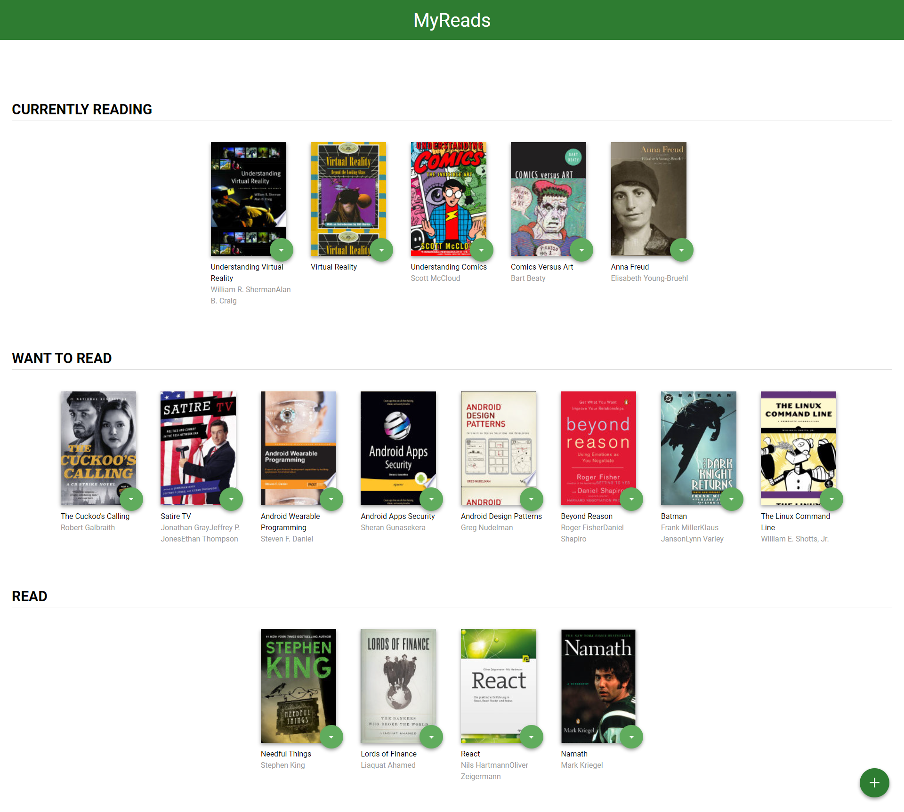
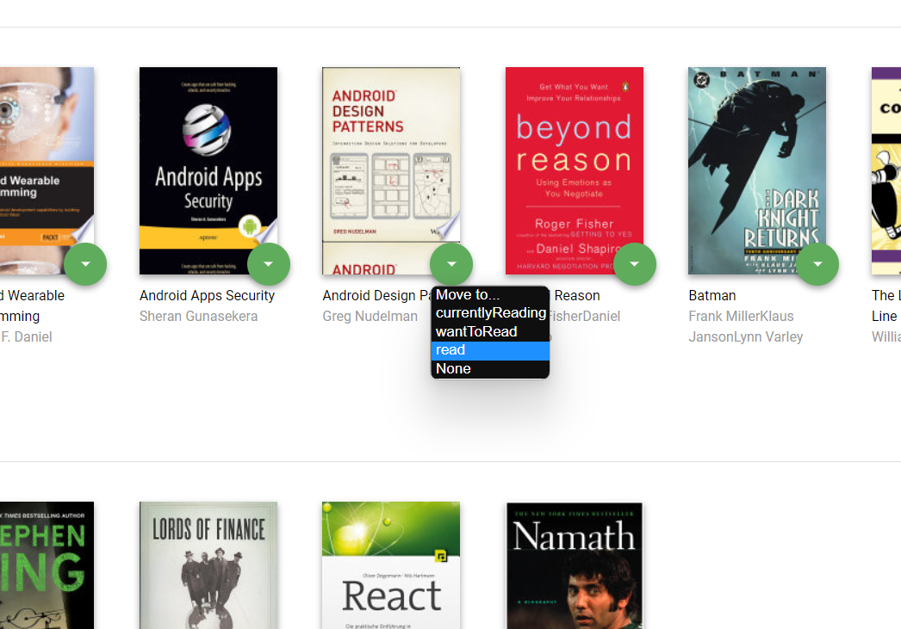
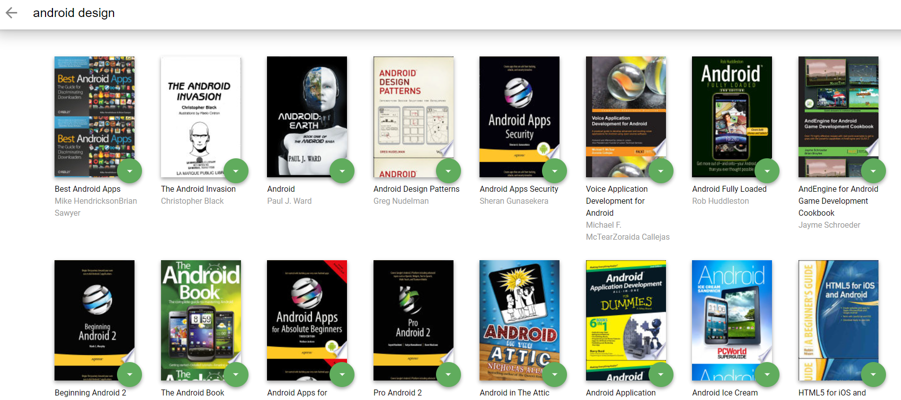

<p align="center">
  <a href="" rel="noopener">
 </a>
</p>

<h3 align="center">MyReads Project</h3>

<div align="center">

[]()
[](https://github.com/kylelobo/The-Documentation-Compendium/issues)
[](https://github.com/kylelobo/The-Documentation-Compendium/pulls)
[](/LICENSE)

</div>

---

<p align="center"> A bookshelf app that allows user to select and categorize books user have read, are currently reading, or want to read.
    <br> 
</p>

## 📝 Table of Contents

- [About](#about)
- [Getting Started](#getting_started)
- [Backend Server](#backend_server)
- [Usage](#usage)
- [Acknowledgments](#acknowledgement)
- [Create React App](#createreactapp)
- [Contributing](#contributing)

## 🧐 About <a name = "about"></a>

This is the starter template for the final assessment project for Udacity's React Fundamentals course. The goal of this app is to allows user to select and categorize books user have read, are currently reading, or want to read. The project emphasizes using React to build the application and provides an API server and client library that user will use to persist information as he/she interact with the application.

## 🏁 Getting Started <a name = "getting_started"></a>

These instructions will get you a copy of the project up and running on your local machine for development and testing purposes.

To get started developing right away:

- install all project dependencies with `npm install`
- start the development server with `npm start`

### Backend Server <a name = "backend_server"></a>

To simplify your development process, we've provided a backend server for you to develop against. The provided file [`BooksAPI.js`](starter/src/BooksAPI.js) contains the methods you will need to perform necessary operations on the backend:

- [`getAll`](#getall)
- [`update`](#update)
- [`search`](#search)

### ### `getAll`

Method Signature:

```js
getAll();
```

- Returns a Promise which resolves to a JSON object containing a collection of book objects.
- This collection represents the books currently in the bookshelves in your app.

### `update`

Method Signature:

```js
update(book, shelf);
```

- book: `<Object>` containing at minimum an `id` attribute
- shelf: `<String>` contains one of ["wantToRead", "currentlyReading", "read"]
- Returns a Promise which resolves to a JSON object containing the response data of the POST request

### `search`

Method Signature:

```js
search(query);
```

- query: `<String>`
- Returns a Promise which resolves to a JSON object containing a collection of a maximum of 20 book objects.
- These books do not know which shelf they are on. They are raw results only. You'll need to make sure that books have the correct state while on the search page.


## 🎈 Usage <a name="usage"></a>

To use the application navigate to 
```
http://localhost:3000
```
and find your reading shelves

[]()

you can move books between shelves

[]()

or you can add new books by clicking add-book button and search for books

[]()

finally you could add any book using embeded controller

[]()


## 🎉 Acknowledgements <a name = "acknowledgement"></a>

The backend API uses a fixed set of cached search results and is limited to a particular set of search terms, which can be found in [SEARCH_TERMS.md](SEARCH_TERMS.md). That list of terms are the _only_ terms that will work with the backend, so don't be surprised if your searches for Basket Weaving or Bubble Wrap don't come back with any results.

## Create React App <a name = "createreactapp"></a>

This project was bootstrapped with [Create React App](https://github.com/facebook/create-react-app). You can find more information on how to perform common tasks [here](https://github.com/facebook/create-react-app/blob/main/packages/cra-template/template/README.md).

## ✍️ Contributing <a name = "contributing"></a>

This repository is the starter code for _all_ Udacity students. Therefore, we most likely will not accept pull requests.

For details, check out [CONTRIBUTING.md](CONTRIBUTING.md).
